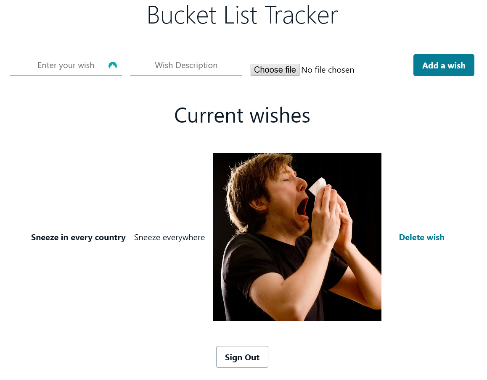
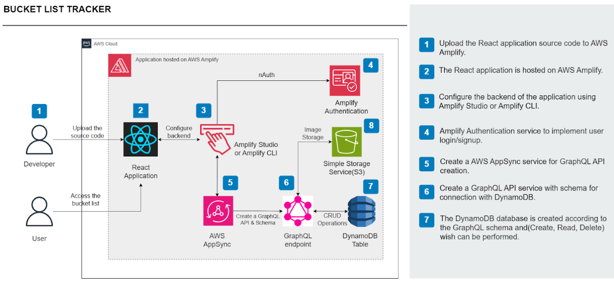
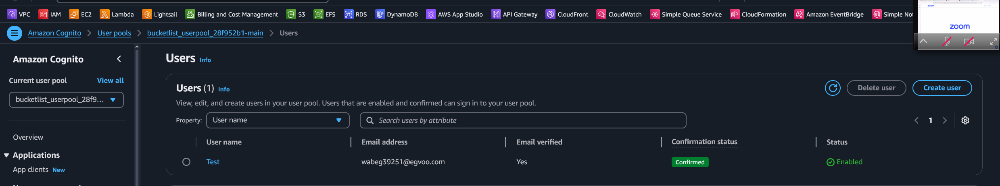
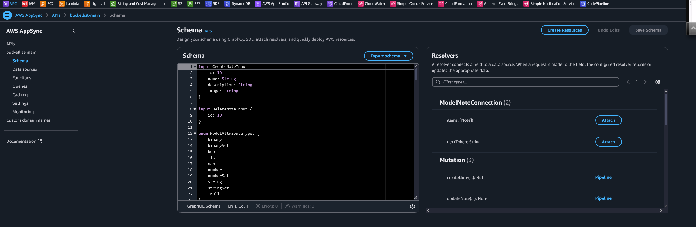
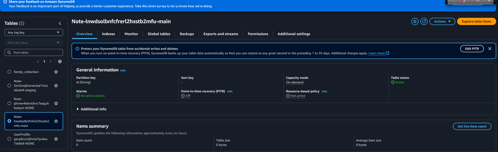
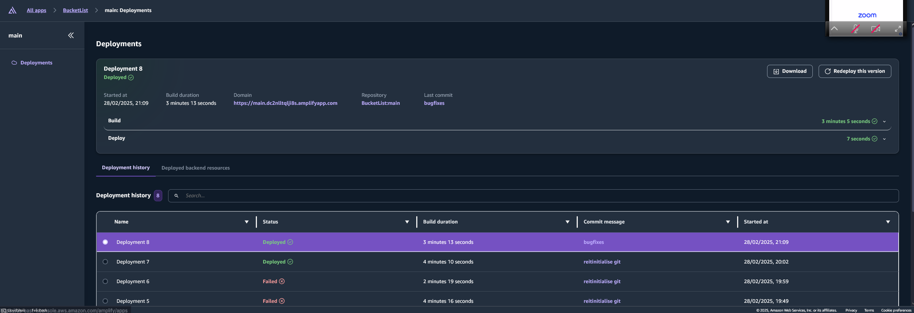

# 🎯 Bucket List Tracker  

*Stay loosely motivated and track your life goals idly slipping away!*  

A **React-powered** bucket list web app built with a **modern serverless architecture using AWS Amplify, AWS AppSync, AWS DynamoDB, Amazon S3, and AWS Cognito**. The app is designed with a **GraphQL API, CI/CD automation, and a fully managed cloud backend**, enabling seamless CRUD operations, authentication, and media storage.  

[🚀 **Live Demo**](https://main.dc2nlltqlji8s.amplifyapp.com/)  

---

## 📝 A Quick Look at the Web App  

When you open **Bucket List Tracker**, you're welcomed into a modern, cloud-powered web app where you can **log in, add goals, upload images, and track your progress**. The frontend is built in **React and AWS Amplify UI components**, with **GraphQL-based API interactions** ensuring efficient data handling.  

All backend configurations and deployments are handled via **AWS Amplify CLI**, enabling developers to iterate quickly without managing infrastructure manually. The CI/CD pipeline within **AWS Amplify Hosting** ensures that any push to the GitHub repository automatically triggers a build and deployment, making the development cycle seamless.  

### 🖼️ **Screenshot Preview**   

---

## 🏗️ Architecture Overview  

### **How It Works**  

✔️ **User Authentication:** Secure login/sign-up handled by **Amazon Cognito**, providing multi-factor authentication (MFA) and OAuth integration.  
✔️ **Frontend:** A **React app** deployed using **AWS Amplify Hosting**, leveraging static site generation and CDNs for optimized performance.  
✔️ **Backend:** Uses **AWS AppSync** with a **GraphQL API**, allowing efficient real-time and batch queries for managing bucket list items.  
✔️ **Database:** **Amazon DynamoDB**, a serverless NoSQL database, provides millisecond latency for querying and updating user data.  
✔️ **File Storage:** **Amazon S3** is used for storing user-uploaded images with fine-grained IAM access policies.  
✔️ **CI/CD Pipeline:** Fully managed **CI/CD with AWS Amplify**, automatically deploying any changes pushed to GitHub.  

---

## 🛠 Service Breakdown  

| Service            | Purpose                                                       |
| ------------------ | ------------------------------------------------------------- |
| **AWS Amplify**    | Handles backend provisioning, GraphQL API, authentication, and hosting. |
| **Amazon Cognito** | Provides secure authentication and authorization with MFA support. |
| **AWS AppSync**    | GraphQL API management, supporting real-time and offline sync. |
| **AWS DynamoDB**   | NoSQL database for storing structured bucket list data. |
| **Amazon S3**      | Secure, scalable object storage for images. |
| **AWS Amplify CI/CD** | Automates deployment upon GitHub push with build and test integration. |

---

## 🔬 Deep Dive: How It Works Under the Hood  

### **GraphQL API with AWS AppSync**  
Instead of using traditional REST APIs, this project leverages **GraphQL via AWS AppSync**, allowing the frontend to request exactly the data it needs with a single query. The AppSync schema defines queries and mutations for handling bucket list items. Example query:

```graphql
query ListNotes {
  listNotes {
    items {
      id
      name
      description
      image
    }
  }
}
```

Mutations allow adding new items:
```graphql
mutation CreateNote($input: CreateNoteInput!) {
  createNote(input: $input) {
    id
    name
    description
    image
  }
}
```

### **Backend Management with AWS Amplify CLI**  
All backend resources (AppSync, Cognito, DynamoDB, S3) were provisioned using the **AWS Amplify CLI**. The `amplify init` command sets up a new cloud backend, and `amplify push` deploys the defined resources. The backend schema is defined in `schema.graphql`, allowing for code-first API development.  

### **Continuous Deployment with AWS Amplify CI/CD**  
Whenever new code is pushed to GitHub, AWS Amplify’s CI/CD pipeline automatically detects changes, builds the app, and deploys it. The build process includes:
- **Installing dependencies** (`npm install`)
- **Generating GraphQL client code** (`amplify codegen`)
- **Running tests** (if applicable)
- **Deploying static files** to an **Amazon CloudFront-backed CDN**  

---

## 🛠️ Setup & Deployment  

Want to run this locally? Here's how:

### **Prerequisites**  
- Node.js & npm installed  
- AWS Amplify CLI configured  
- Git installed  

### **Clone & Install**  

```bash
# Clone the repository
git clone https://github.com/PinnerSinner/bucket-list-tracker-app.git
cd bucket-list-tracker-app

# Install dependencies
npm install
```

### **Amplify Setup**  

```bash
# Initialize Amplify
amplify init

# Deploy backend resources
amplify push
```

### **Run Locally**  

```bash
npm start
```

---

## 🏆 Advanced Features & Future Enhancements  

🔹 **GraphQL Subscriptions** for real-time updates 🔄  
🔹 **Fine-grained IAM role management** for restricting S3 access 🔐  
🔹 **Optimized caching with AWS AppSync and DynamoDB** ⚡  
🔹 **Custom authentication flows using Cognito Lambda triggers** 🔑  
🔹 **Dark mode for better accessibility** 🌙  

---

## 🤝 Contributing  

Feel free to open **issues** and submit **pull requests**!  

---

## 📜 License  

MIT License © 2025 **Marcoverse**  

**Built with ❤️ using AWS Amplify**  

